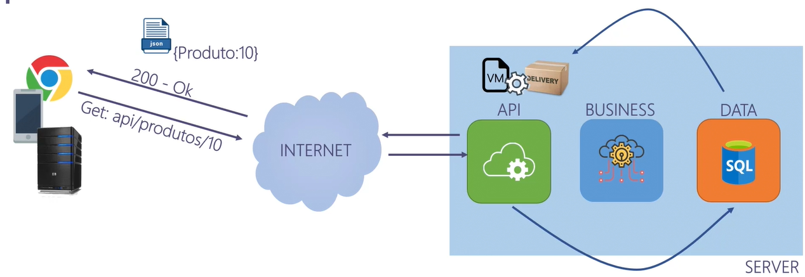
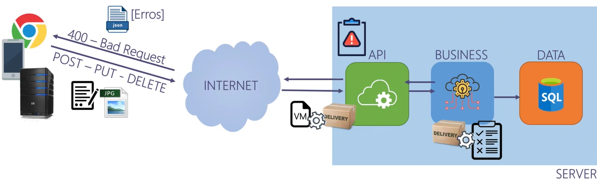

# 📦 Estrutura Inicial da Solution `APICompleta`

## 1. Criar a solution em branco

```bash
dotnet new sln -n APICompleta
```
## 2. Crie a seguinte estrutura de pastas 

APICompleta/
│
├── src/          # Contém todos os projetos da aplicação
│   ├── DevIO.Api         # Projeto principal da API
│   ├── DevIO.Business    # Regras de negócio e entidades
│   └── DevIO.Data        # Acesso a dados
│
├── tests/       # Projetos de testes
├── sql/         # Scripts e arquivos de banco de dados


mesmo que já tenhamos os arquivos das pastas Data e Business, iremos criar pelo terminal o projeto, pois queremos na última versão e iremos refatorando 
``` bash
dotnet new classlib -n Dev.Data
```
``` bash
dotnet new classlib -n Dev.Business
```


## 3. Crie os projetos dentro da pasta src
```bash
cd src
dotnet new webapi -n DevIO.Api --use-controllers
``` 
## 4. Incluir referências entre os projetos
API depende de business

```bash
dotnet add DevIO.Api/DevIo.Api.csproj reference DevIo.Business/DevIo.Business.csproj
```
API depende de Data

```bash
dotnet add DevIO.Api/DevIo.Api.csproj reference DevIo.Data/DevIo.Data.csproj 
```
No visual studio isso é possível fazer pela interface, no VsCode precisa ser pelo terminal.

Resultado no arquivo .csproj da API

```bash 
  <ItemGroup>
    <ProjectReference Include="..\DevIo.Business\DevIo.Business.csproj" />
    <ProjectReference Include="..\DevIo.Data\DevIo.Data.csproj" />
  </ItemGroup>
```

# Escopo do projeto
Entidade Fornecedor implementada na camada de negócios. Essa entidade representa uma tabela no banco de dados relacionada com outras entidades( Endereço(1:1), Produtos(1: N))

Fluxo de leitura


Fluxo de gravaçao (post, put ou delete)



# implementando DTOs (ViewModels)
Temos algumas entidades mas não podemos expor elas na camada api 
implementar na paste DevIo.Api uma pasta chamada ViewModels e dentro dela criar três arquivos: EnderecoViewModel, FornecedorViewModel e ProdutoViewModel

# Criar controllers
podemis iniciar com a MainController: 
- validação de notificação de erro
- validação de modelstate
- validação da operação de negócios

# instalar AutoMapper
Esse código permite instalar a biblioteca automapper e biblioteca que permite injeção de dependência 
```bash
dotnet add package AutoMapper.Extensions.Microsoft.DependencyInjection
```

# Criar pasta Configuration
Criar arquivo AutoMapperConfig e injetar as informações
```bash
CreateMap<Fornecedor, FornecedorViewModel>().ReverseMap();  
CreateMap<Endereco, EnderecoViewModel>().ReverseMap();  
CreateMap<Produto, ProdutoViewModel>().ReverseMap();  
``` 

#  Configura o AutoMapper no Program.cs para usar o perfil definido
```bash 
builder.Services.AddAutoMapper(typeof(DevIO.Api.AutoMapper.AutoMapperConfig));
```
# Criar novo Controller Fornecedores separado
# Configurar Injeção de Dependência 


# instalar no Business
dotnet add package FluentValidation
dotnet add package Microsoft.EntityFrameworkCore
dotnet add package Microsoft.EntityFrameworkCore.SqlServer
dotnet add package Microsoft.EntityFrameworkCore.Design

# instalar no Data
dotnet add package Microsoft.Extensions.Configuration.Json


# criar banco 
```bash
dotnet ef database update
```
update pq o migration já existe

Durante o design-time, o EF Core não executa o Program.cs, então ele não consegue acessar a connection string dessa forma. Por isso, você precisa de uma classe IDesignTimeDbContextFactory que forneça explicitamente a connection string.